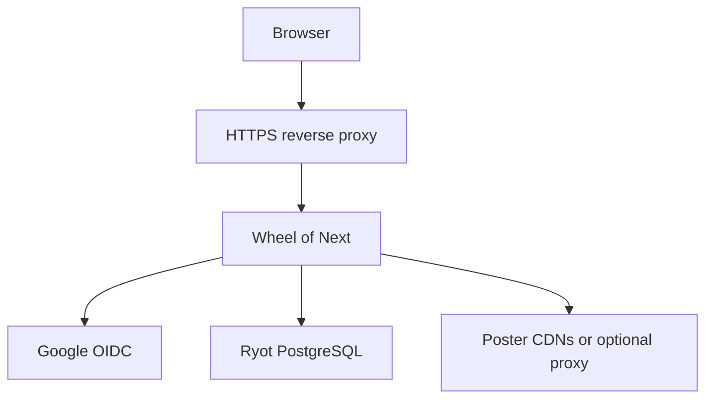

# Wheel of Next

Wheel of Next is a self-hosted decision wheel for choosing what to watch, play, or read next. It uses media and collection data from an existing [Ryot](https://github.com/IgnisDa/ryot) PostgreSQL database, then adds weighted presets, virtual collections, an animated wheel, and spin history.

> Wheel of Next is an independent project and is not affiliated with Ryot.

## Features

- Animated canvas-based decision wheel
- Weighted selection by Ryot collection
- Presets for media types, collections, and custom weights
- Virtual collections for choices that do not exist in Ryot
- Authenticated spin history
- Guest mode using a configured owner's library
- Server-side poster proxy, resizing, and cache
- Google OpenID Connect authentication
- Swagger UI and JSON health endpoint
- Prebuilt Docker image published to GitHub Container Registry

## How it works



Wheel of Next does **not** install or replace Ryot. A working Ryot database is required for a full deployment. The application reads users, media, and collections from Ryot and stores its own presets, virtual collections, and history in separate `won_*` tables in the same PostgreSQL database.

## Requirements

- A running Ryot instance with PostgreSQL
- Docker Engine with the Compose plugin for production deployment
- A domain name and HTTPS reverse proxy for public deployment
- A Google OAuth 2.0 Web application
- Network access from Wheel to the Ryot database and Google

For development without Docker, use Node.js 20 or newer.

## Production deployment with Docker Compose

The recommended setup runs Wheel as a separate container on the Docker network used by Ryot. PostgreSQL does not need to be exposed publicly.

### 1. Find the Ryot Docker network

On the Docker host, list the available networks:

```bash
docker network ls
```

For a Compose project named `ryot`, the network is commonly named `ryot_default`. Confirm that the Ryot PostgreSQL container is attached to it:

```bash
docker network inspect ryot_default
```

The PostgreSQL service name on that network is used as `PGHOST`; it is commonly `postgres`.

### 2. Create the deployment directory

```bash
sudo install -d -m 0750 /opt/wheel-of-next
cd /opt/wheel-of-next
```

Create `compose.yml`:

```yaml
services:
  wheel:
    image: ghcr.io/erdelylevy/wheel-of-next:latest
    restart: unless-stopped
    env_file:
      - .env
    ports:
      - "127.0.0.1:3000:3000"
    volumes:
      - poster-cache:/app/.cache/posters
    networks:
      - ryot

volumes:
  poster-cache:

networks:
  ryot:
    external: true
    name: ${RYOT_NETWORK:-ryot_default}
```

Binding port `3000` to `127.0.0.1` keeps Wheel private and makes it accessible only through the reverse proxy on the same host.

### 3. Create the application environment

Create `/opt/wheel-of-next/.env`:

```dotenv
# Docker network containing the Ryot PostgreSQL container
RYOT_NETWORK=ryot_default

# Public URL, without a trailing slash
APP_PUBLIC_ORIGIN=https://example.com

# Use /wheel for https://example.com/wheel/.
# Use / when Wheel is hosted at the domain root. Do not leave this empty.
APP_PUBLIC_PREFIX=/wheel

# Google OAuth 2.0 Web application
GOOGLE_CLIENT_ID=replace-me.apps.googleusercontent.com
GOOGLE_CLIENT_SECRET=replace-me

# Generate with: openssl rand -hex 32
SESSION_SECRET=replace-with-a-long-random-value

# Google OIDC subject whose Ryot library is shown to unauthenticated guests
GUEST_OWNER_OIDC_ID=replace-me

# Existing Ryot PostgreSQL database
PGHOST=postgres
PGPORT=5432
PGUSER=postgres
PGPASSWORD=replace-me
PGDATABASE=postgres
PGSSL=false
PGSSL_REJECT_UNAUTHORIZED=true

# Optional application settings
PORT=3000
POSTER_FETCH_CONCURRENCY=4
DEBUG_POSTER_LOGS=false

# Optional HTTP proxy used only for downloading posters
# POSTER_PROXY_URL=http://proxy:1080
```

Protect the file because it contains credentials:

```bash
chmod 600 .env
```

`GUEST_OWNER_OIDC_ID` is the Google `sub` associated with the Ryot user whose library should be available in guest mode. If Ryot uses Google OIDC, it can normally be found in the Ryot database:

```sql
SELECT id, oidc_issuer_id
FROM "user"
WHERE oidc_issuer_id IS NOT NULL;
```

### 4. Prepare the database

Wheel expects the Ryot `user` table, a `wheel_items` view, and three application-owned tables. Run the following SQL in the Ryot database before starting Wheel:

```sql
CREATE TABLE IF NOT EXISTS won_presets (
    id text PRIMARY KEY DEFAULT gen_random_uuid()::text,
    user_id text NOT NULL,
    name text NOT NULL,
    media_types text[] NOT NULL DEFAULT '{}',
    collections text[] NOT NULL DEFAULT '{}',
    virtual_collection_ids text[] NOT NULL DEFAULT '{}',
    weights jsonb NOT NULL DEFAULT '{}'::jsonb,
    created_at timestamptz NOT NULL DEFAULT now(),
    updated_at timestamptz NOT NULL DEFAULT now()
);

CREATE TABLE IF NOT EXISTS won_virtual_collections (
    id text PRIMARY KEY,
    user_id text NOT NULL,
    name text NOT NULL,
    media text NOT NULL,
    poster text,
    source_label text,
    source_url text,
    created_at timestamptz NOT NULL DEFAULT now(),
    updated_at timestamptz NOT NULL DEFAULT now()
);

CREATE TABLE IF NOT EXISTS won_history (
    id text PRIMARY KEY DEFAULT gen_random_uuid()::text,
    user_id text NOT NULL,
    preset_id text,
    preset_name text,
    winner_id text,
    winner jsonb,
    wheel_items jsonb NOT NULL DEFAULT '[]'::jsonb,
    base_history_id text,
    created_at timestamptz NOT NULL DEFAULT now(),
    updated_at timestamptz NOT NULL DEFAULT now()
);

CREATE INDEX IF NOT EXISTS won_presets_user_id_idx
    ON won_presets (user_id);

CREATE INDEX IF NOT EXISTS won_virtual_collections_user_id_idx
    ON won_virtual_collections (user_id);

CREATE INDEX IF NOT EXISTS won_history_user_created_idx
    ON won_history (user_id, created_at DESC);
```

The application also requires a `wheel_items` view that exposes Ryot metadata in this shape:

| Column | Purpose |
| --- | --- |
| `id` | Ryot metadata ID |
| `title` | Display title |
| `media_type` | Normalized media type |
| `category_name` | Ryot collection name |
| `poster` | Remote poster URL |
| `user_id` | Owner of the Ryot collection |

Additional fields such as description, year, rating, episode counts, page count, and platforms are displayed when available. The exact SQL depends on the Ryot version because its internal schema can change. An example for Ryot installations using the `metadata`, `collection`, and `collection_to_entity` tables is:

```sql
CREATE OR REPLACE VIEW wheel_items AS
SELECT
    m.id,
    m.id AS meta_id,
    m.title,
    lower(m.lot) AS media_type,
    c.name AS category_name,
    m.description,
    m.publish_year,
    m.provider_rating,
    m.production_status,
    m.source,
    m.source_url,
    (m.assets -> 'remote_images') ->> 0 AS poster,
    NULLIF((m.show_specifics ->> 'total_seasons')::integer, 0) AS total_seasons,
    NULLIF((m.show_specifics ->> 'total_episodes')::integer, 0) AS total_episodes,
    NULLIF((m.anime_specifics ->> 'episodes')::integer, 0) AS anime_episodes,
    NULLIF((m.book_specifics ->> 'pages')::integer, 0) AS pages,
    (
        SELECT COALESCE(
            array_agg(DISTINCT release.value ->> 'name'),
            ARRAY[]::text[]
        )
        FROM jsonb_array_elements(
            COALESCE(
                m.video_game_specifics -> 'platform_releases',
                '[]'::jsonb
            )
        ) AS release(value)
        WHERE release.value ? 'name'
    ) AS platforms,
    c.user_id AS user_id
FROM metadata AS m
JOIN collection_to_entity AS cte ON cte.metadata_id = m.id
JOIN collection AS c ON c.id = cte.collection_id;
```

Review this view after every major Ryot upgrade. If Ryot uses different table or JSON field names, adapt the view while preserving the output column names expected by Wheel.

### 5. Configure Google OAuth

In Google Cloud Console, create an OAuth 2.0 Client ID with application type **Web application**.

For a deployment at `https://example.com/wheel/`, add:

- Authorized JavaScript origin: `https://example.com`
- Authorized redirect URI: `https://example.com/wheel/auth/callback`

The redirect URI must exactly match:

```text
APP_PUBLIC_ORIGIN + APP_PUBLIC_PREFIX + /auth/callback
```

For a root deployment with `APP_PUBLIC_PREFIX=/`, the callback is `https://example.com/auth/callback`.

### 6. Configure the reverse proxy

Example Nginx configuration for serving Wheel under `/wheel/`:

```nginx
location = /wheel {
    return 301 /wheel/;
}

location /wheel/ {
    proxy_pass http://127.0.0.1:3000/;
    proxy_http_version 1.1;

    proxy_set_header Host $host;
    proxy_set_header X-Real-IP $remote_addr;
    proxy_set_header X-Forwarded-For $proxy_add_x_forwarded_for;
    proxy_set_header X-Forwarded-Proto $scheme;
}
```

The trailing slash in `proxy_pass http://127.0.0.1:3000/;` is intentional: Nginx removes the external `/wheel/` prefix before forwarding the request to Express.

Validate and reload Nginx:

```bash
sudo nginx -t
sudo systemctl reload nginx
```

Use Certbot, Caddy, Traefik, or another ACME client to provide HTTPS. Google OAuth should not be deployed over plain public HTTP.

### 7. Start and verify Wheel

```bash
docker compose pull
docker compose up -d
docker compose ps
```

Check the application directly from the Docker host:

```bash
curl -fsS http://127.0.0.1:3000/api/health
```

For the Nginx example above, check the public endpoint:

```bash
curl -fsS https://example.com/wheel/api/health
```

Expected response:

```json
{"ok":true}
```

Then open `https://example.com/wheel/` and test Google sign-in, presets, history, and poster loading.

## Root-path deployment

To host Wheel at `https://wheel.example.com/` instead of a subpath:

```dotenv
APP_PUBLIC_ORIGIN=https://wheel.example.com
APP_PUBLIC_PREFIX=/
```

Proxy the whole virtual host to `http://127.0.0.1:3000` without stripping a path prefix.

## Poster downloads and optional proxy

Posters are fetched by the Wheel server, resized with Sharp, and cached in `/app/.cache/posters`. The Compose example persists this directory in the `poster-cache` volume.

If some poster CDNs are unavailable from the hosting provider, configure an HTTP proxy:

```dotenv
POSTER_PROXY_URL=http://proxy:1080
```

Only poster downloads use this proxy. Database access, Google OIDC, and other application traffic remain direct. The proxy hostname must be reachable from the Wheel container; attach both services to a shared Docker network when the proxy itself runs in Docker.

## Updating and rolling back

Every push to `main` publishes two `linux/amd64` images:

- `ghcr.io/erdelylevy/wheel-of-next:latest`
- `ghcr.io/erdelylevy/wheel-of-next:sha-<full-commit-sha>`

Update to the latest image:

```bash
cd /opt/wheel-of-next
docker compose pull
docker compose up -d --remove-orphans
docker compose ps
```

For a reproducible deployment or rollback, replace `latest` in `compose.yml` with a known `sha-...` tag, then run the same commands.

## Logs and troubleshooting

Follow application logs:

```bash
docker compose logs -f --tail 100 wheel
```

Common problems:

| Symptom | Check |
| --- | --- |
| Health endpoint returns `500` | PostgreSQL address, credentials, network, and `SELECT 1` access |
| Login redirects incorrectly | `APP_PUBLIC_ORIGIN`, `APP_PUBLIC_PREFIX`, forwarded protocol header, and the Google redirect URI |
| Login works but no Ryot items appear | `GUEST_OWNER_OIDC_ID`, the Ryot `user.oidc_issuer_id`, and `wheel_items.user_id` |
| Presets or history fail | The `won_*` tables and database write permissions |
| Posters return `502` or time out | Outbound CDN access; configure `POSTER_PROXY_URL` if required |
| Works directly but not behind Nginx | Prefix stripping, trailing slash in `proxy_pass`, and forwarded headers |

Enable request-level poster diagnostics temporarily with:

```dotenv
DEBUG_POSTER_LOGS=true
```

Disable it again after troubleshooting to reduce log volume.

## Local development

Clone the repository and install dependencies:

```bash
git clone https://github.com/ErdelyLevy/Wheel-of-Next.git
cd Wheel-of-Next
npm ci
```

Create `.env` using the same variables described above. For a local root deployment, use:

```dotenv
APP_PUBLIC_ORIGIN=http://localhost:3000
APP_PUBLIC_PREFIX=/
```

A full local environment still needs access to a compatible Ryot PostgreSQL database and a Google OAuth client whose redirect URI includes `http://localhost:3000/auth/callback`.

Start the application:

```bash
npm start
```

Run the frontend linter:

```bash
npm run lint
```

## API and health endpoints

When deployed under `/wheel`, the main endpoints are:

- Application: `/wheel/`
- Health check: `/wheel/api/health`
- Swagger UI: `/wheel/docs`
- OpenAPI JSON: `/wheel/openapi.json`
- Authentication: `/wheel/auth/login`, `/wheel/auth/callback`, `/wheel/auth/logout`

Express exposes the same routes without the external prefix when accessed directly on port `3000`.

## Operational notes

- Sessions currently use the in-memory Express session store. Run a single replica unless a shared session store is added.
- A container restart invalidates active login sessions but does not remove presets or history stored in PostgreSQL.
- Back up the Ryot PostgreSQL database before schema changes or major upgrades.
- Do not commit `.env` files, database passwords, OAuth secrets, or session secrets.
- Prefer a dedicated database role with the minimum permissions required for the Ryot read tables/view and the `won_*` tables.

## Technology

- Node.js 20, Express 5, ESM
- PostgreSQL
- Vanilla HTML, CSS, and JavaScript
- Sharp for poster transformation
- OpenID Connect through Google
- Docker and GitHub Container Registry

## License

The package metadata currently declares the ISC license. Add a repository-level `LICENSE` file before relying on the project as formally licensed software.
